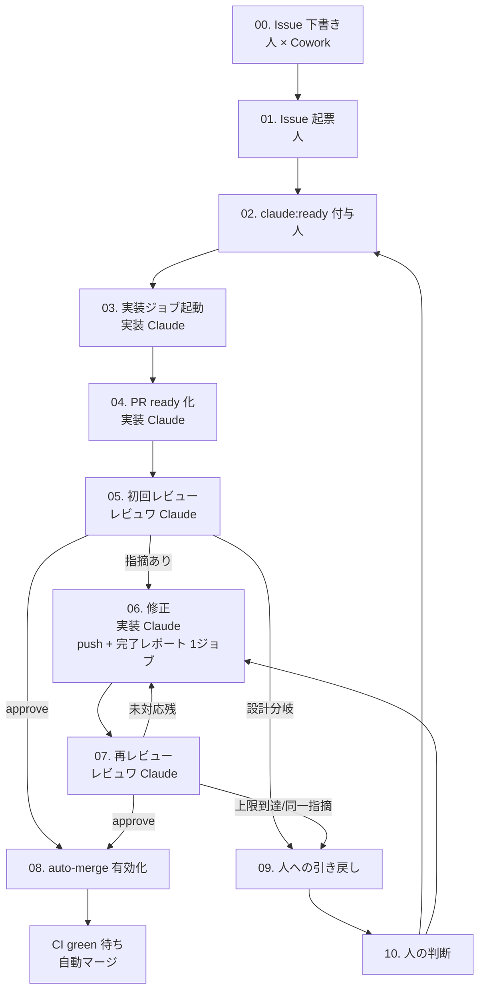

# Claude 自動化 運用手順(Strategy)

本ドキュメントは claude-automation 基盤の運用手順を記載する。意思決定の理由は `docs/adr/0001-claude-automation-design.md`、規約は `docs/automation/conventions.md` を参照。

## 1. 全体フロー



## 2. 各フェーズの詳細

### 00. Issue 下書き(フロー外)

- 主体: 人 × Cowork
- 入力: アイデア・要件・既存 Issue の進行状況
- 作業: 要件・スコープ・受入条件を整理。親子 Issue 関係を Cowork が把握。`area/*` + `priority/*` + `task-type:impl|design` を提案
- 出力: Issue 下書き(本文 + ラベル案)

### 01. Issue 起票

- 主体: 人
- 入力: Cowork の下書き
- 作業: GitHub で Issue 作成。task-type と area/priority を付ける
- 出力: Issue (open)

### 02. 実装 GO サイン

- 主体: 人
- 作業: `claude:ready` ラベル付与。実装着手の意思表示
- 出力: Issue (claude:ready 付き)

### 03. 実装ジョブ起動

- 主体: 実装 Claude(GHA)
- トリガー: `issues.labeled` で `claude:ready`
- 作業:
  - task-type に応じたプロンプト選択
  - Issue 本文、関連規約、関連 ADR を読み込み
  - 対象コード(または設計文書)を読む
  - 実装方針を Issue にコメント
  - ブランチ作成、実装コミット
  - PR (draft) を open(空の未対応テーブル付き description)
- 出力: PR (draft)

### 04. PR ready 化

- 主体: 実装 Claude
- 作業: PR を `ready_for_review` に変更。レビュー開始シグナル
- 出力: PR (ready)

### 05. 初回レビュー

- 主体: レビュワ Claude(GHA)
- トリガー: `pull_request.ready_for_review`
- 作業:
  - task-type に応じた観点チェックリスト実行
  - 差分・未対応テーブル・規約・ADR を読む
  - 指摘あり → review コメント(changes_requested)
  - 指摘無し → approve
- 出力: review コメント or approve

### 06. 修正

- 主体: 実装 Claude
- トリガー: `pull_request_review.submitted(changes_requested)` または `pull_request_review_comment.created`(将来 Review に統一予定)
- 作業:
  - 全レビューコメント + 過去対応履歴を読む
  - 修正コミット push
  - PR description の未対応テーブル更新コミット
  - PR コメントで「対応完了レポート」投稿(マーカー `<!-- claude:impl-done -->` 付き)
  - **push と完了レポート投稿は 1 ジョブで完結**(切断防止)
- 出力: 修正コミット + 対応完了レポートコメント

### 07. 再レビュー

- 主体: レビュワ Claude
- トリガー: `issue_comment.created` かつ body に `<!-- claude:impl-done -->`
- 作業:
  - PR 全差分 + 全レビューコメント + 最新「対応完了レポート」+ 未対応テーブル + 規約 + ADR を読む
  - 未対応残 or 新規問題 → review コメント追加(→ 06 へ戻る)
  - 全 ✓ + CI green → approve
- 出力: approve or review コメント追加

### 08. auto-merge 有効化

- 主体: auto-merge ワークフロー
- トリガー: `pull_request_review.submitted(approved)` かつ `needs-human-decision` ラベル無し
- 作業: `gh pr merge --auto --squash` を実行(有効化)。以降は CI green が揃った時点で自動マージ
- 出力: auto-merge 有効化 → CI green 待ち自動マージ → Issue 連動 close

### 09. 人への引き戻し

- 主体: notify-human ワークフロー
- トリガー:
  - Claude が `needs-human-decision` ラベル付与
  - ラリー上限到達
  - 同一指摘 2 回連続
  - approve 後でも分岐発覚はあり得る
- 作業:
  - `@win2cot` メンションコメント自動投稿
  - 直前の Claude コメントから「判断理由・選択肢・推奨案」を要約
  - auto-merge を保険で無効化(`gh pr merge --disable-auto`)
- 出力: 人宛てメンション + auto-merge 解除

### 10. 人の判断

- 主体: 人
- 作業:
  - 採るべき方針をコメントで明示
  - `needs-human-decision` を外す
  - `claude:ready` 再付与 or PR で「この方針で再実装」を指示
  - 必要なら Cowork に相談(規約/ADR 更新は Cowork に依頼)
- 出力: ラベル更新 + 方針コメント

## 3. アクター使い分けガイドライン(初期版)

| 状況 | 主体 |
|---|---|
| 議論したい / 文書を整えたい / 規約や ADR の下書き / Issue ステアリング | Cowork |
| Issue が 1 つに閉じていて、自動で実装してほしい | GHA Claude(実装) |
| ローカルで動かして確認したい / 大量ファイル一気に作りたい / 複数 Issue 跨ぐ / 新規リポジトリ初期化 | Claude Code |
| 意思決定 / ジャッジ / 設計分岐 | 人 |

初期は緩い運用とし、オーバーラップしたら随時このガイドラインを更新する。

## 4. 自動マージ条件

以下を **すべて** 満たすこと:

1. レビュワ Claude が approve 済み
2. ブランチ保護の Required check が green(既存 CI のみ。Claude 関連 workflow は Required にしない)
3. `needs-human-decision` ラベルが付いていない
4. 未対応テーブルに `open` 状態の指摘が残っていない

## 5. エスカレーション(`needs-human-decision`)の付与条件

レビュワ Claude / 実装 Claude のどちらかが以下のいずれかを判断したらラベル付与:

- ADR / 規約に書かれていない設計判断が必要
- 破壊的 API 変更
- 本番影響が大きい(マイグレーション、認可境界、課金)
- スコープ拡大が必要(Issue で合意した範囲を超える)
- ラリー上限到達 / 同一指摘の連続検知
- 外部システム(他リポジトリ・他チーム)との調整が必要

判定基準の詳細化は ADR で別途決定する(残課題 R04)。

## 6. tasks-webapi(利用者リポジトリ)側の取り込み方

```yaml
# tasks-webapi/.github/workflows/claude-impl.yml
name: Claude Impl
on:
  issues:
    types: [labeled]
jobs:
  impl:
    if: github.event.label.name == 'claude:ready'
    uses: win2cot/claude-automation/.github/workflows/reusable-impl.yml@v1
    secrets: inherit
```

tag(`@v1`, `@v2`)で版管理することで tasks-webapi 側の workflow ファイル変更を `uses:` 行のみに抑え、Workflow validation エラーの発生頻度を最小化する。

## 7. 関連ドキュメント

- `docs/adr/0001-claude-automation-design.md`
- `docs/automation/conventions.md`
- `docs/automation/prompts/`
- `docs/ops/setup-github-app.md`
- `docs/ops/runbook.md`
- `docs/cost/budget.md`
